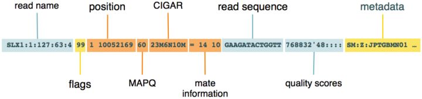
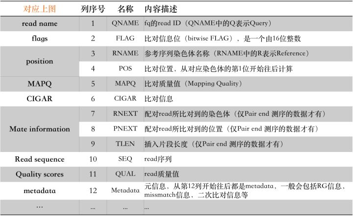
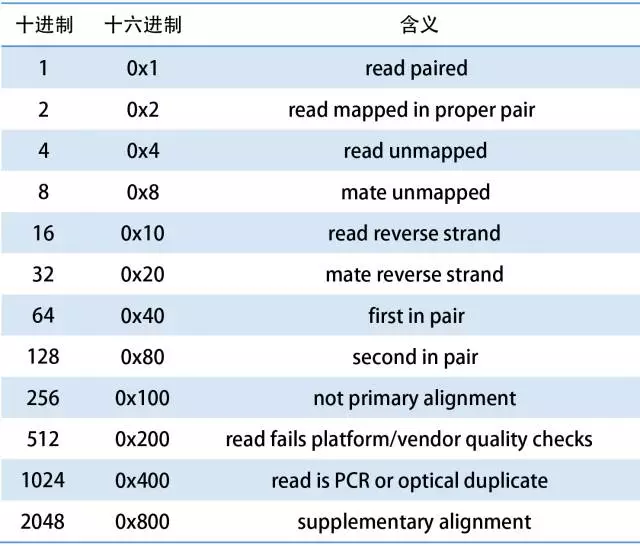
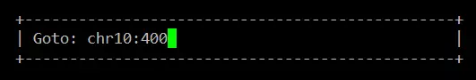

## 目录

* [FileFormat](#FileFormat)
  * [general](#general)
    * [fastq-fasta](#fastq-fasta)
    * [bam-sam](#bam-sam)
    * [bed-bedgraph](#bed-bedgraph)
    * [wig-bigwig](#wig-bigwig)
    * [bcf-vcf](#bcf-vcf)
    * [gf-gtf](#gf-gtf)
  * [manipulation](#manipulation)
    * [samtools](#samtools)
    * [bedtools](#bedtools)
    * [BCFtools*](#BCFtools*)

# FileFormat

## general

&emsp;&emsp;下面总结的一些格式文件，在[Genome browser FAQ](https://genome.ucsc.edu/FAQ/FAQformat.html#format1.7)都能够找到，下面的还有一些更详细或更适合参考信息及说明。

##### fastq-fasta

&emsp;&emsp;两种储存sequence的格式，参考[Fasta和Fastq详解](https://zhuanlan.zhihu.com/p/20714540)

##### bam-sam

&emsp;&emsp;BAM是目前基因数据分析中最通用的**比对数据存储格式**，它既适合于短read也适合于长read，最长可以支持128Mbp的超大read！除了后缀是.bam之外，可能还会看到.cram，甚至.sam后缀的文件，其实它们一个是BAM的高压缩格式(.cram)——IO效率比原来的BAM要略差；另一个是BAM的纯文本格式（.sam）。[理解并操作BAM文件](https://zhuanlan.zhihu.com/p/31405418),[如何使用Python处理BAM](https://zhuanlan.zhihu.com/p/31625187)，[Sam、Bam、Cram格式详解](https://zhuanlan.zhihu.com/p/31405418)

- header

  &emsp;Header每一行都用`@` 符号开头，里面主要包含了版本信息，序列比对的参考序列信息，如果是标准工具（bwa，bowtie，picard）生成的BAM，一般还会包含生成该份文件的参数信息，如`@PG`。

- record

  &emsp;record每个字段之间用 `tab`符号分开，至少包含以下字段：

  







##### bed-bedgraph

&emsp;&emsp;BED 文件格式提供了一种灵活的方式来定义的数据行，**以用来描述注释的信息，BED行有3个必须的列和9个额外可选的列**，每行的数据格式要求一致。一般peaks文件是bed格式。[bed格式详解](https://zhuanlan.zhihu.com/p/27876814)，[bed格式的四种形式](https://zhuanlan.zhihu.com/p/49560007)，BedToBedgraph使用代码`awk '{ print $1"\t"$2"\t"$3"\t"$5 }' summits.bed > summits.bedgraph`

##### wig-bigwig

&emsp;&emsp;&emsp;Wiggle、BigWig和bedgraph仅仅用于追踪参考基因组的各个区域的覆盖度，测序深度。与sam/bam格式文件不同，bam或者bed格式的文件主要是为了追踪我们的reads到底比对到了参考基因组的哪些区域。注意这几者的差别。**Wiggle、BigWig和bedgraph均由UCSC规定的文件格式，可以无缝连接到UCSC的Genome Browser工具里面进行可视化。**[Wiggle、BigWig和bedgraph](https://vip.biotrainee.com/d/169-wiggle-bigwig-bedgraph)

##### bcf-vcf

&emsp;&emsp;VCF([Variant Call Forma](http://vcftools.sourceforge.net/specs.html))是一种文本文件格式，用于存储变异数据，最初设计用于SNP和短INDEL的存储，也是用于结构变异的存储。它包含元信息行，标题行，然后是数据行，每行包含有关基因组中位置的信息；BCF( binary variant call format)，是VCF的二进制版本，它与VCF中保留的信息相同，而对于大量样本而言，BCF处理效率更高。BCF和VCF之间的关系类似于BAM和SAM之间的关系[中文VCF解析](https://blog.csdn.net/u012150360/article/details/70666213)。

##### gff-gtf

&emsp;&emsp;两种文件格式非常类似，均为9列[参考文档](https://asia.ensembl.org/info/website/upload/gff.html)：

| 1                       | 2                 | 3            | 4                | 5              | 6     | 7      | 8     | 9          |
| ----------------------- | ----------------- | ------------ | ---------------- | -------------- | ----- | ------ | ----- | ---------- |
| reference sequence name | annotation source | feature type | start coordinate | end coordinate | score | strand | frame | attributes |

&emsp;&emsp;GFF(general feature format)，是一种用来描述基因组特征的文件，现在使用的大部分都是GFF3。GFF允许使用`#`作为注释符号，例如：

```shell
##gff-version 3
##created 11/11/11
```

```shell
# 注意观察第九列
# ID属性是必需的
# Parent属性，它表明了当前的特征是Parent特征的子集。

Contig01  PFAM  gene  501  750  .  +  0  ID=geneA;Name=geneA
Contig01  PFAM  exon  501  650  .  +  2  ID=exonA1;Parent=geneA
Contig01  PFAM  exon  700  750  .  +  2  ID=exonA2;Parent=geneA
```

&emsp;&emsp;GTF(gene transfer format)，当前主流版本是GTF2，主要是用来对基因进行注释。GTF格式有两个硬性标准：

- 根据所使用的软件的不同，`feature types`是必须注明的。

- 第9列必须以`gene_id`以及`transcript_id`开头

  ```shell
  # 第9列示例,注意对比GFF
  gene_id "geneA";transcript_id "geneA.1";database_id "0012";modified_by "Damian";duplicates 0;
  ```

&emsp;&emsp;差异比较：

| 列                      | GTF2                                    | GFF3            |
| ----------------------- | --------------------------------------- | --------------- |
| reference sequence name | same                                    | same            |
| annotation source       | same                                    | same            |
| feature type            | feature requirements depend on software | can be anything |
| start coordinate        | same                                    | same            |
| 5. end coordinate       | same                                    | same            |
| score                   | not used                                | optional        |
| strand                  | same                                    | same            |
| frame                   | same                                    | same            |
| attributes              | space-separator                         | `=`             |

## manipulation

##### samtools

&emsp;&emsp;顾名思义就是用于处理sam与bam格式的工具软件，能够实现二进制查看、格式转换、排序及合并等功能，结合sam格式中的flag、tag等信息，还可以完成比对结果的统计汇总。同时利用linux中的grep、awk等操作命令，还可以大大扩展samtools的使用范围与功能。从samtools还分离出一个**专门用于处理高通量数据的API——htslib**。[samtools Mannual](http://www.htslib.org/doc/samtools.html)。特别的，当文件还比较小的情况，关于查看bam数据，我们可以使用[IGV工具](http://software.broadinstitute.org/software/igv/)。

- `samtools view`

  &emsp;---查看sam文件（sam 格式转bam）

  ```shell
  -b：bam格式输出
  -1：use fast BAM compression (implies -b)
  -u：以未压缩的bam格式输出，一般与linux命令配合使用
  -C：output CRAM (requires -T)
  -h：在sam输出中包含header信息
  -H：只输出header信息
  -c：print only the count of matching records
  -S       ignored (input format is auto-detected)
  -T, --reference FILE
                 Reference sequence FASTA FILE [null]
  
  -f [INT]：只输出在比对flag中包含该整数的序列信息
  -F [INT]：跳过比对flag中含有该整数的序列
  -o [file]：标准输出结果文件
  
  -@, --threads INT 线程数
  
  # 常用示例：
  $ samtools view -bS test.sam > test.bam
  $ samtools view  -h test.bam > test.sam
  ```

- `samtools sort`

  &emsp;根据左起位点对序列排序，并输出为bam文件

  ```shell
  $ samtools sort [options] <input_file> <output_file>
  
  -l INT     Set compression level, from 0 (uncompressed) to 9 (best)
  -m INT     Set maximum memory per thread; suffix K/M/G recognized [768M]
  -n         Sort by read name
  -o FILE    Write final output to FILE rather than standard output
  -T PREFIX  Write temporary files to PREFIX.nnnn.bam
  -@, --threads INT
  ```

- `samtools merge`

  &emsp;将多个排序后的序列文件合并为一个文件

  ```shell
  $ samtools merge [-nurlf] [-h inh.sam] [-b <bamlist.fofn>] <out.bam> <in1.bam> [<in2.bam> ... <inN.bam>]
  
  -n：指定输入文件是以reads名称排序的（与sort中的-n参数配合使用）
  -b FILE:FILE中每行是一个需要merge的bam文件
  ```

- `samtools cat`

  &emsp;将多个bam文件合并为一个bam文件（与merge命令的区别是cat不需要将bam文件提前进行排序）

  ```shell
  $ samtools cat [-h header.sam] [-o out.bam] <in1.bam> [...]
  ```

- `samtools flagstat`

  &emsp;---统计bam文件中的比对flag信息，并输出比对统计结果

  ```shell
  $ samtools flagstat eg2.bam
  
  # 统计结果
  # total：分析的总reads数（bam文件所有行数）
  # mapped：比对上的reads数（总体比对率）
  # paired in sequencing：成对的reads总数
  # read1：属于reads1的reads数量
  # read2：属于reads2的reads数量
  # properly paired：正确配对的reads数量
  # with itself and mate mapped：一对reads均比对上的reads数
  # singletons：只有单条reads比对上的reads数
  ```

- `samtools index`

  &emsp;对排序后的序列建立索引，并输出为bai文件，用于快速随机处理

  ```shell
  $ samtools index <sorted_bam_file>
  ```

- `samtools tview`

  &emsp;以文本定位查看器的方式来展示各条reads的比对情况

  ```shell
  $ samtools tview [options] <sorted_bam_file> [参考基因组fasta文件]
  
  #   -d display      output as (H)tml or (C)urses or (T)ext 
  #   -p chr:pos      go directly to this position
  #   -s STR          display only reads from this sample or group
  ```

  &emsp;第一行为参考序列的碱基坐标，第二行为参考序列，第三行开始即为按排序顺序依次比对上参考序列的各条reads，其中仍以碱基字符表示的则是与参考序列有差异的部分;可在该界面中按g键，并在出现的方框内输入想要查看的参考序列名及对应位置信息就可以快速跳转到该位置上:

  

- `samtools depth`

  &emsp;计算每个位点的深度值（所有reads中包含该点的总数),输出结果从左到右依次为参考基因组、在基因组上的位置、深度值。

  ```shell
  $ samtools depth [options] <排序后的bam文件1> <排序后的bam文件2>
  
  -q [int]：基础reads质量阈值
  -Q [int]：mapping质量阈值
  -r [chr:from-to]：选择需要统计深度的区域
  ```

##### bedtools

&emsp;&emsp;BEDTools是可用于genomic features的比较，相关操作及进行注释的工具。而genomic features通常使用Browser Extensible Data (BED) 或者 General Feature Format (GFF)文件表示，用UCSC Genome Browser进行可视化比较。[bedtools使用文档](https://bedtools.readthedocs.io/en/latest/index.html)

#####  BCFtools*