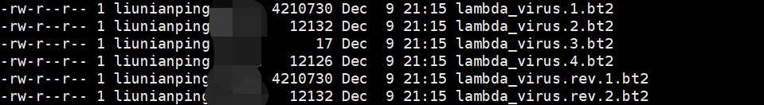
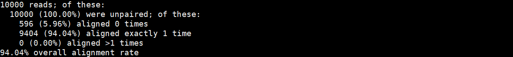

[TOC]


# BioInfo-Tools

### 数据下载

##### sra-tools

&emsp;&emsp;常用命令：`prefetch`、`fastq-dump`

&emsp;&emsp;SRA是NIH的高通量测序数据的主要档案，是国际核苷酸序列数据库协作（INSDC）的一部分，包括NCBI SRA，欧洲生物信息学研究所（EBI）和日本DNA数据库（DDBJ），提交给三个组织中任何一个的数据在它们之间共享。[SRA-tools-download-documentation](https://trace.ncbi.nlm.nih.gov/Traces/sra/sra.cgi?view=software)

##### gdc-tranfer-tool

&emsp;&emsp;常用命令：`./gdc-client download 22a29915-6712-4f7a-8dba-985ae9a1f005`

&emsp;&emsp;Genomic Data Commons（GDC）是美国国家癌症研究所（NCI）的研究项目。GDC的使命是为**癌症研究界(cancer research community)**提供统一的数据存储库，以便在癌症基因组研究中共享数据，以支持精准医学。[gdc-documentation](https://docs.gdc.cancer.gov/Data_Transfer_Tool/Users_Guide/Data_Download_and_Upload/)

##### aspera

```shell
# 安装与使用
wget https://download.asperasoft.com/download/sw/connect/3.8.1/ibm-aspera-connect-3.8.1.161274-linux-g2.12-64.tar.gz
tar -xvf ibm-aspera-connect-3.8.1.161274-linux-g2.12-64.tar.gz
./ibm-aspera-connect-3.8.1.161274-linux-g2.12-64.sh  # installation dir:~/.aspera
export PATH=$PATH:~/.aspera/connect/bin/  # temp
ascp -i ~/asperaweb_id_dsa.openssh anonftp@ftp-private.ncbi.nlm.nih.gov:/sra/sra-instant/reads/ByExp/sra/SRX/SRX189/SRX189773/SRR576933/SRR576933.sra ./
```

&emsp;&emsp;The Aspera transfer platform is the the most advanced software solution for file transfer, synchronization and streaming of digital assets, allowing users and enterprises secure high speed movement of all of their data over any distance, to any environment, with none of the waiting.[中文参考](https://www.jianshu.com/p/a6ac81456c01)

### 辅助工具

##### GNU parallel

&emsp;&emsp;GNU Parallel是一个shell工具，为了在一台或多台计算机上并行的执行计算任务。通常的输入是文件列表、主机列表、用户列表、URL列表或者表格列表；一个计算任务也可以是一个从管道读取的一条命令。GNU Parallel会把输入分块，然后通过管道并行的执行。GNU Parallel保证它的输出与顺序执行计算任务时是一样的，这样就可以方便的把GNU Parallel的输出做为其它程序的输入。[官方参考](https://www.gnu.org/software/parallel/), [中文参考1](https://blog.csdn.net/huozhanfeng/article/details/38497707),[中文参考2](https://www.jianshu.com/p/c5a2369fa613)

```shell
(wget -O - pi.dk/3 || curl pi.dk/3/) | bash  # installation dir :~/bin
man parallel_tutorial  # man手册
```

### 质量控制

##### fastqc

&emsp;&emsp;FastQC是一款基于Java的软件，一般都是在linux环境下使用命令行运行，它可以快速多线程地对测序数据进行质量评估（Quality Control）。[中文参考](https://zhuanlan.zhihu.com/p/20731723)，[Fastqc官方](https://www.bioinformatics.babraham.ac.uk/projects/fastqc/Help/)

functionality:

- **Import of data from BAM, SAM or FastQ files (any variant)**
- Providing a quick overview to tell you in which areas there may be problems
- Summary graphs and tables to quickly assess your data
- Export of results to an HTML based permanent report
- Offline operation to allow automated generation of reports without running the interactive application

```shell
fastqc [-o output_dir] [--(no)extract] [-f fastq|bam|sam] [-c contaminant file] seqfile1 .. seqfileN

# 主要是包括前面的各种选项和最后面的可以加入N个文件
# -o --outdir FastQC生成的报告文件的储存路径，生成的报告的文件名是根据输入来定的
# --extract 生成的报告默认会打包成1个压缩文件，使用这个参数是让程序不打包
# -t --threads 选择程序运行的线程数，每个线程会占用250MB内存，越多越快咯


# -c --contaminants 污染物选项，输入的是一个文件，格式是Name [Tab] Sequence，里面是可能的污染序列，如果有这个选项，FastQC会在计算时候评估污染的情况，并在统计的时候进行分析，一般用不到
# -a --adapters 也是输入一个文件，文件的格式Name [Tab] Sequence，储存的是测序的adpater序列信息，如果不输入，目前版本的FastQC就按照通用引物来评估序列时候有adapter的残留
# -q --quiet 安静运行模式，一般不选这个选项的时候，程序会实时报告运行的状况。
```

 &emsp;举例说明：

```shell
fastqc -o qc_output -t 5 ExampleData_hg19/Pat1_1.fq
```


##### cutadapter

&emsp;&emsp;cutadapt软件是最常用的去adapter的工具。它是基于Python编写的一个Python包.[中文参考](https://zhuanlan.zhihu.com/p/20776942),[官方文档](https://cutadapt.readthedocs.io/en/stable/guide.html)，主要包括三部分内容：

- read modifications
- cut adapters
- Filtering of processed reads

```shell
# cut adapters
# 去掉3‘端AAAAAAA和5’端的adapter TTTTTTT ,若输入输出压缩文件，则直接output.fq.gz 
# -b表示both,3'和5'端, -j 表示核心数
$ cutadapt -a AAAAAAA -g TTTTTTT -j 4 -o output.fastq input.fastq
#For paired-end reads:
$ cutadapt -a ADAPT1 -A ADAPT2 [options] -o out1.fastq -p out2.fastq in1.fastq in2.fastq

# read modifications
$ cutadapt -u 5 -u -5 -o trimmed.fastq input_reads.fastq

# cutadapt软件可以使用-q参数进行reads质量的过滤。基本原理就是，一般reads头和尾会因为测序仪状态或者是反应时间的问题造成测序质量差，比较粗略的一个过滤办法就是-q进行过滤。需要特别说明的是，这里的-q对应的数字和phred值是不一样的，它是软件根据一定的算法计算出来的。
# 3‘端进行一个简单的过滤,--quality-base=33是指序列使用的是phred33计分系统
$ cutadapt -q 10 --quality-base=33 -o output.fastq input.fastq 
# 3‘端 5’端都进行过滤,3'的阈值是10，5‘的阈值是15
$ cutadapt -q 10,15 --quality-base=33 -o output.fastq input.fastq

# 下面是根据长度过滤
[--minimum-length N or -m N] # 当序列长度小于N的时候，reads扔掉
[--too-short-output FILE] # 上面参数获得的这些序列不是直接扔掉，而是输出到一个文件中
[--maximum-length N or -M N] # 当序列长度大于N的时候，reads扔掉
[--too-long-output FILE] # 上面参数获得的这些序列不是直接扔掉，而是输出到一个文件中
```


##### trim_galore*

&emsp;&emsp;<u>Trim Galore是对FastQC和Cutadapt的包装</u>。**适用于所有高通量测序，可以自动检测adapter**，包括RRBS(Reduced Representation Bisulfite-Seq ), Illumina、Nextera 和smallRNA测序平台的双端和单端数据。[推荐一篇有趣的文章](https://www.jianshu.com/p/7a3de6b8e503)，[trim_galore](https://github.com/FelixKrueger/TrimGalore/blob/master/Docs/Trim_Galore_User_Guide.md)的主要功能包括:

- 去除低质量碱基

- 去除3' 末端的adapter

  Illumina: AGATCGGAAGAGC

  Small RNA: TGGAATTCTCGG

  Nextera: CTGTCTCTTATA

  ```shell
  trim_galore -q 20 --phred33 --stringency 3 --length 20 -e 0.1 \
              --paired fq1 fq2  \
              --gzip -o output_dir
   # 质量过滤           
  --quality：设定Phred quality score阈值，默认为20。
  --phred33：：选择-phred33或者-phred64，表示测序平台使用的Phred quality score。
  # 去除adpater
  --adapter：输入adapter序列。也可以不输入，Trim Galore!会自动寻找可能性最高的平台对应的adapter。自动搜选的平台三个，也直接显式输入这三种平台，即--illumina、--nextera和--small_rna。
  --stringency：设定可以忍受的前后adapter重叠的碱基数，默认为1。可以适度放宽，因为后一个adapter几乎不可能被测序仪读到。
  # 长度过滤
  --length：设定输出reads长度阈值，小于设定值会被抛弃。
  # 双端过滤
  --paired：对于双端测序结果，一对reads中，如果有一个被剔除，那么另一个会被同样抛弃，而不管是否达到标准。
  --retain_unpaired：对于双端测序结果，一对reads中，如果一个read达到标准，但是对应的另一个要被抛弃，达到标准的read会被单独保存为一个文件。
  
  --gzip和 --dont_gzip：清洗后的数据zip打包或者不打包。
  ```


##### trimmomatic

&emsp;&emsp;Trimmomatic是**针对Illumina高通量测序平台**设计的**接头去除和低质量reads清洗**软件。软件中包括有Illumina平台常见接头序列，可以很方便处理单端和双端RNA-seq数据。Trimmomatic也支持自己设计要去除的接头序列文件，**目前的HiSeq系列和MiSeq系列用的都是TruSeq3，TruSeq2是以前GA2系列的测序仪所用的**。[Trimmomatic](https://www.jianshu.com/p/a8935adebaae)，[官方文档](http://www.usadellab.org/cms/?page=trimmomatic)

```shell
# PE
java -jar path/to/trimmomatic-0.36.jar PE -phred33 -trimlog logfile input_forward.fq.gz input_reverse.fq.gz output_forward_paired.fq.gz output_forward_unpaired.fq.gz output_reverse_paired.fq.gz output_reverse_unpaired.fq.gz ILLUMINACLIP:/path/to/adapters/TruSeq3-PE.fa:2:30:10 SLIDINGWINDOW:4:15 LEADING:3 TRAILING:3 MINLEN:36

# SE
java -jar trimmomatic-0.35.jar SE -phred33 input.fq.gz output.fq.gz ILLUMINACLIP:TruSeq3-SE:2:30:10 LEADING:3 TRAILING:3 SLIDINGWINDOW:4:15 MINLEN:36


# 参数讨论

# ILLUMINACLIP:/path/to/adapters/TruSeq3-PE.fa:2:30:10
TruSeq3-PE.fa是接头序列，2是比对时接头序列时所允许的最大错配数；30指的是要求PE的两条read同时和PE的adapter序列比对，匹配度加起来超30%，那么就认为这对PE的read含有adapter，并在对应的位置需要进行切除【注】。10和前面的30不同，它指的是，我就什么也不管，反正只要这条read的某部分和adpater序列有超过10%的匹配率，那么就代表含有adapter了，需要进行去除；

# SLIDINGWINDOW
滑动窗口长度的参数, SLIDINGWINDOW:5:20代表窗口长度为5，窗口中的平均质量值至少为20，否则会开始切除；
# LEADING
规定read开头的碱基是否要被切除的质量阈值；
#TRAILING，
规定read末尾的碱基是否要被切除的质量阈值；
# MINLEN
规定read被切除后至少需要保留的长度，如果低于该长度，会被丢掉。

# -threads 线程数
# -summary <statsSummaryFile> 信息
# -trimlog <logfile> 日志
# -quiet 安静模式
# -validatePairs PE模式下验证双端
```


##### fastx-toolkit

&emsp;&emsp;fastx Toolkit是包含处理fastq/fasta文件的一系列的工具，它是基于java开发，PGM 测序数据一般用fastx-toolkit，当然其他数据也可以。[中文参考-简](https://zhuanlan.zhihu.com/p/20776942)，[官方文档](http://hannonlab.cshl.edu/fastx_toolkit/commandline.html)，包括以下工具：

> FASTQ-to-FASTA---格式转换
> FASTQ/A Quality Statistics---基本统计信息
> FASTQ Quality chart
> FASTQ/A Nucleotide Distribution chart
> FASTQ/A Clipper---reads过滤和adapter裁剪
> FASTQ/A Renamer
> FASTQ/A Trimmer---快速序列切割
> FASTQ/A Collapser
> FASTQ/A Artifacts Filter
> FASTQ Quality Filter
> FASTQ/A Reverse Complement
> FASTA Formatter
> FASTA nucleotides changer
> FASTA Clipping Histogram
> FASTX Barcode Splitter

&emsp;&emsp;&emsp;记录几个主要工具：

```shell
$ fastx_clipper [-a ADAPTER] [-k -v -z] [-i INFILE] [-o OUTFILE]
[-h] = 获得帮助信息.
[-a ADAPTER] = Adapter序列信息. 默认的是CCTTAAGG
[-z] = 调用GZip软件，输出的文件自动经过压缩.

[-k] = 报告adater的序列信息
[-v] = 报告序列总数
[-D]= Debug output.

[-l N] = 如果1条reads小于N就抛弃，默认5.
[-d N] = 保留adapter并保留后面的Nbp，如果设置-d 0等于没有用这个参数.
[-c] = 只保留包含adapter的序列
[-C] = 只保留不包含adapter的序列
[-n] = 如果reads中有N，保留reads.（默认是有N的序列删除）
```

​	

```shell
$ fastx_trimmer [-h] [-f N] [-l N] [-z] [-v] [-i INFILE] [-o OUTFILE]
[-h] = 获得帮助信息.
[-f N] = 序列中从第几个碱基开始保留. 默认是1.
[-l N] = 序列最后保留到多少个碱基，默认是整条序列全部保留.
[-z] = 调用GZip软件，输出的文件自动经过压缩.
```


### 基因组比对

&emsp;&emsp;BWA和Bowtie都是基于BWT转换算法构建的快速比对算法，Bowtie2则是对Bowtie算法的一个改进，如允许deletion的出现。二代测序数据一般长250bp,有相对较高的精度0.1%（Q30），目前比较常用的就是Bowtie2。

##### bowtie

&emsp;&emsp;bowtie1 2009年出现的工具，对于测序长度在50bp以下的序列效果不错，而bowtie2主要针对的是长度在50bp以上的测序的，另外很重要一点，**bowtie不支持 gap open**。

##### bwa


##### bowtie2

&emsp;&emsp;2012年出现的比对工具，用于将测序基因比对到参考基因组，Bowtie 2 支持gapped, local和 paired-end比对，[bowtie2官方文档](http://bowtie-bio.sourceforge.net/bowtie2/manual.shtml)

```shell
# 代码示例
$ bowtie2-build files_str_sepWith_comma ./hg19_index/bt2_hg19_index
$ bowtie2 -p 6 --phred33 --very-sensitive -x ./hg19_index/bt2_hg19_index -U ./sra/SRR363795.fastq -S test_95.sam


# 必须参数
-x <bt2-idx> 由bowtie2-build所生成的索引文件的前缀
-S <hit> 所生成的SAM格式的文件前缀。默认是输入到标准输出。

-1 <m1> 双末端测寻对应的文件1。可以为多个文件，并用逗号分开；多个文件必须和 -2 
<m2> 中制定的文件一一对应。比如:"-1 flyA_1.fq,flyB_1.fq -2 flyA_2.fq,flyB
_2.fq". 测序文件中的reads的长度可以不一样。
-2 <m2> 双末端测寻对应的文件2.
-U <r> 非双末端测序对应的文件。可以为多个文件，并用逗号分开。测序文件中的reads的
长度可以不一样。

# 可选参数
# 输入形式选项
-q # 输入的文件为FASTQ格式文件，此项为默认值。
-qseq # 输入的文件为QSEQ格式文件。
-f # 输入的文件为FASTA格式文件,此时 --ignore-quals被默认加上。
-r # 输入的文件中，每一行代表一条序列，没有序列名和测序质量等,此时 --ignore-quals被默认加上。
-c <seq_str_sepWith_comma> # 紧跟其后为比对的reads序列，序列间用逗号隔开,此时 --ignore-quals被默认加上。
-s/--skip <int> # input的reads中，跳过前<int>个reads或者pairs。
-u/--qupto <int> # 只比对前<int>个reads或者pairs
-5/--trim5 <int> # 剪掉5'端<int>长度的碱基，再用于比对。(default: 0).
-3/--trim3 <int> # 剪掉3'端<int>长度的碱基，再用于比对。(default: 0).
--phred33 # 输入的碱基质量等于ASCII码值加上33.
--phred64 # 输入的碱基质量等于ASCII码值加上64.
--solexa-quals # 将Solexa的碱基质量转换为Phred。在老的GA Pipeline版本中得以
运用,Default: off.
--int-quals # 输入文件中的碱基质量为用“ ”分隔的数值，而不是ASCII码,Default: off.
–local # local alignment
```

&emsp;&emsp;举一个实例，来源[官方文档](http://bowtie-bio.sourceforge.net/bowtie2/manual.shtml)

1. 比对单端测序数据

   - 建立索引

     ```shell
     $ BT2_HOME='path/to/bowtie2-2.3.4.3/'
     $ BT2_HOME/bowtie2-build $BT2_HOME/example/reference/lambda_virus.fa lambda_virus
     ```

     

   - 比对

     ```shell
     # 默认全局比对，可以加上--local，进行局部比对
     $ bowtie2 -x lambda_virus -U $BT2_HOME/example/reads/reads_1.fq -S eg1.sam
     ```

     

2. 比对双端测序数据

   - 比对

     ```shell
     $BT2_HOME/bowtie2 -x $BT2_HOME/example/index/lambda_virus -1 $BT2_HOME/example/reads/reads_1.fq -2 $BT2_HOME/example/reads/reads_2.fq -S eg2.sam
     ```

   - SAM-to-BAM

     ```shell
     $ samtools view -bS eg2.sam > eg2.bam
     ```

   - BAM-to-sortedBAM

     ```shell
     $ samtools sort eg2.bam -o eg2.sorted.bam
     ```

     &emsp;&emsp;Sorted BAM is a useful format because the alignments are (a) compressed, which is convenient for long-term storage, and (b) sorted, which is conveneint for variant discovery. To generate variant calls in VCF format.

   - downstream analysis

     ```shell
     $ samtools mpileup -uf $BT2_HOME/example/reference/lambda_virus.fa eg2.sorted.bam | bcftools view -Ov - > eg2.raw.bcf
     
     $ bcftools view eg2.raw.bcf
     ```

### 峰值探测

##### MACS2

&emsp;&emsp;MACS2是peak calling最常用的工具，这是MACS2的主要功能，因为MACS2的目的就是找peak，其他功能都是可有可无，唯独`callpeak`不可取代。[MACS2](https://www.jianshu.com/p/6a975f0ea65a)

### motif分析

##### Homer

&emsp;&emsp;HOMER最初是为了使发现ChIP-Seq peaks富集motif的过程自动化，更一般地，HOMER分析富集motif的基因组位置，不仅限于ChIP-Seq peaks。使用homer，所有用户真正需要的是包含基因组坐标的文件（HOMER peak file or  BED file），然后HOMER会处理后续过程。[homer manual](http://homer.ucsd.edu/homer/ngs/peakMotifs.html)

### 可视化

##### deeptools

&emsp;&emsp;deeptools就是用来对单个或者多个比对好的bam文件进行信息统计并进行可视化分析的，所以ChIP-seq和RNA-seq及其它类型的二代测序结果都是可以借以分析。[deeptools-简书](https://www.jianshu.com/p/7cc5df9f7900)

# BioInfo-FileFomat

## 格式解析

[Genome browser FAQ](https://genome.ucsc.edu/FAQ/FAQformat.html#format1.7)

##### fastq & fasta

&emsp;&emsp;两种储存sequence的格式，参考[Fasta和Fastq详解](https://zhuanlan.zhihu.com/p/20714540)

##### bam & sam

&emsp;&emsp;BAM是目前基因数据分析中最通用的**比对数据存储格式**，它既适合于短read也适合于长read，最长可以支持128Mbp的超大read！除了后缀是.bam之外，可能还会看到.cram，甚至.sam后缀的文件，其实它们一个是BAM的高压缩格式(.cram)——IO效率比原来的BAM要略差；另一个是BAM的纯文本格式（.sam）。[理解并操作BAM文件](https://zhuanlan.zhihu.com/p/31405418),[如何使用Python处理BAM](https://zhuanlan.zhihu.com/p/31625187)

##### bed & bedgraph

&emsp;&emsp;BED 文件格式提供了一种灵活的方式来定义的数据行，**以用来描述注释的信息，BED行有3个必须的列和9个额外可选的列**，每行的数据格式要求一致。一般peaks文件是bed格式。[bed格式详解](https://zhuanlan.zhihu.com/p/27876814)，[bed格式的四种形式](https://zhuanlan.zhihu.com/p/49560007)

##### wig & bigwig

&emsp;&emsp;&emsp;Wiggle、BigWig和bedgraph仅仅用于追踪参考基因组的各个区域的覆盖度，测序深度。与sam/bam格式文件不同，bam或者bed格式的文件主要是为了追踪我们的reads到底比对到了参考基因组的哪些区域。注意这几者的差别。**Wiggle、BigWig和bedgraph均由UCSC规定的文件格式，可以无缝连接到UCSC的Genome Browser工具里面进行可视化。**[Wiggle、BigWig和bedgraph](https://vip.biotrainee.com/d/169-wiggle-bigwig-bedgraph)

##### bcf&vcf

##### gff

##### gtf

##### MAF

## 格式工具

##### samtools

&emsp;&emsp;顾名思义就是用于处理sam与bam格式的工具软件，能够实现二进制查看、格式转换、排序及合并等功能，结合sam格式中的flag、tag等信息，还可以完成比对结果的统计汇总。同时利用linux中的grep、awk等操作命令，还可以大大扩展samtools的使用范围与功能。从samtools还分离出一个**专门用于处理高通量数据的API——htslib**。[Sam、Bam、Cram格式详解](https://zhuanlan.zhihu.com/p/31405418)，[pysam处理sam数据](https://zhuanlan.zhihu.com/p/31625187)，[Samtools命令详解](https://www.jianshu.com/p/15f3499a6469)，[samtools Mannual](http://www.htslib.org/doc/samtools.html)。特别的，当文件还比较小的情况，关于查看bam数据，我们可以使用[IGV工具](http://software.broadinstitute.org/software/igv/)。

##### bedtools

&emsp;&emsp;BEDTools是可用于genomic features的比较，相关操作及进行注释的工具。而genomic features通常使用Browser Extensible Data (BED) 或者 General Feature Format (GFF)文件表示，用UCSC Genome Browser进行可视化比较。[bedtools使用文档](https://bedtools.readthedocs.io/en/latest/index.html)， [bedtools-中文](https://blog.csdn.net/g863402758/article/details/53391354)

#####  BCFtools

# BioInfo-DataBase

- UCSC
- ENSEMBL
- NCBI

# Other

- 氨基酸表示

  > ```text
  > A  alanine               P  proline       
  > B  aspartate/asparagine  Q  glutamine      
  > C  cystine               R  arginine      
  > D  aspartate             S  serine      
  > E  glutamate             T  threonine      
  > F  phenylalanine         U  selenocysteine      
  > G  glycine               V  valine        
  > H  histidine             W  tryptophan        
  > I  isoleucine            Y  tyrosine
  > K  lysine                Z  glutamate/glutamine
  > L  leucine               X  any
  > M  methionine            *  translation stop
  > N  asparagine            -  gap of indeterminate length
  > ```

  &emsp;

- 核苷酸表示

  > ```text
  > A  adenosine          C  cytidine             G  guanine
  > T  thymidine          N  A/G/C/T (any)        U  uridine 
  > K  G/T (keto)         S  G/C (strong)         Y  T/C (pyrimidine) 
  > M  A/C (amino)        W  A/T (weak)           R  G/A (purine)        
  > B  G/T/C              D  G/A/T                H  A/C/T      
  > V  G/C/A              -  gap of indeterminate length
  > ```

&emsp;

# Write_In_The_End

建议分析测序数据之前先搞清楚以下两个方面：

- 原始数据是通过哪种测序平台产生的；它们的错误率分布是怎么样的；是否有一定的偏向性和局限性；是否会显著受GC含量的影响等；
- 评估它们有可能影响哪些方面的分析；

从以下方面认识原始测序数据：

- read各个位置的碱基质量值分布
- 碱基的总体质量值分布
- read各个位置上碱基分布比例，目的是为了分析碱基的分离程度
- GC含量分布
- read各位置的N含量
- read是否还包含测序的接头序列
- read重复率，这个是实验的扩增过程所引入的

