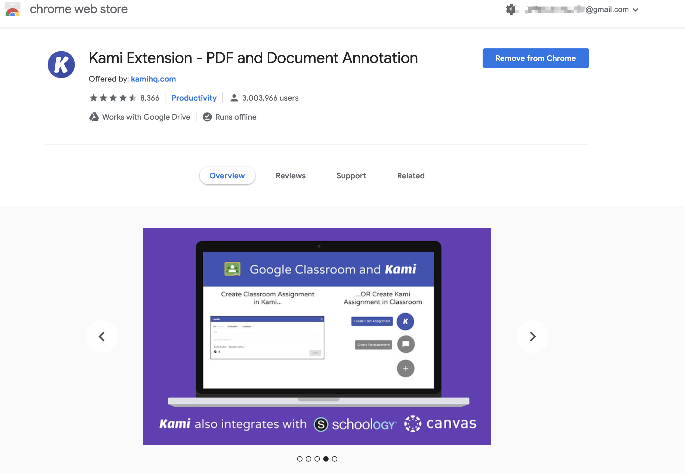
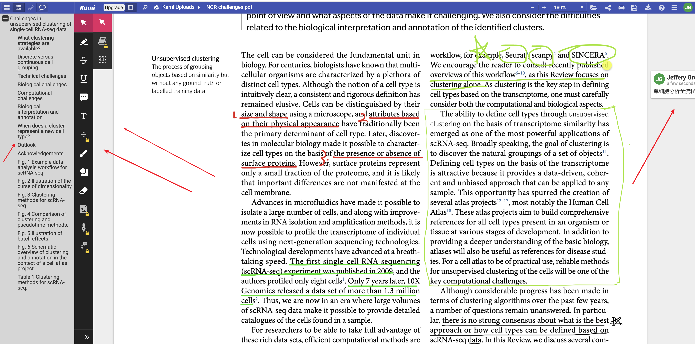
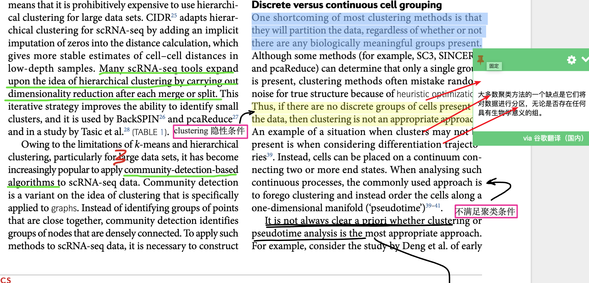
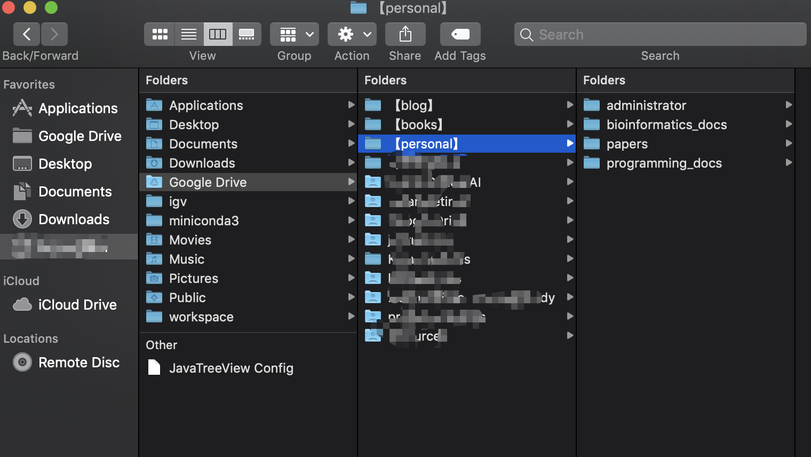
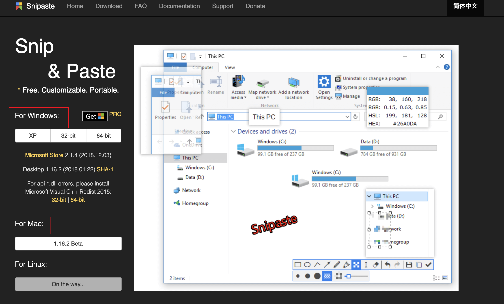
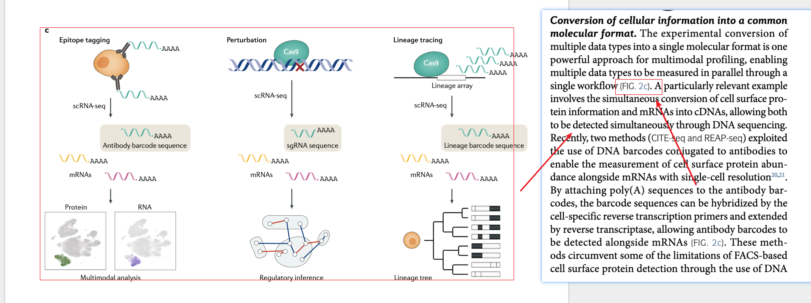

&emsp;&emsp;毕业季要写毕业论文了，那么你首先肯定需要看很多很多的论文，想要高效、舒心的看论文，那么，你肯定需要有一套给力的论文装备，比如你需要一个完美的阅读器，你需要一个完美的文献管理器，你又可能需要一个翻译词典，这里我将分享我的看论文装备，让你的效率大大提高！

- Step1— 安装google浏览器

  史上最强浏览器，插件众多，功能强悍，不多解释, Chrome 浏览器下载：https://www.google.com/intl/zh-CN_ALL/chrome/

  

- Step2— 安装kami阅读器

  &emsp;你是否还在用浏览器打开PDF，你是否还在用Adobe Reader打开PDF, 如果你还在用浏览器、用edge打开，你不怕被嘲笑么？如果你用Adobe Reader打开，你不曾觉得翻页卡么？穷则思变，我这里推荐Kami阅读器：

  安装方法：chrome/settings/extensions/chrome web store

  我这里已经安装了，所以会显示 Remove From Chrome,如果你尚未安装应该显示， ADD To Chrome

  

  接下来，你就可以点击Chrome右上角的kami插件图标，愉快的阅读论文啦～，Kami包括免费版和付费版，不过免费版的功能已经非常强了，目录导航，标注，划线，样样精通：

  

  

  

- Step3— 安装划词翻译

  &emsp; 我们是不是还差点什么？对，没错，那就是翻译软件了，经过使用多款插件，当然也包括有道词典，但是在`划词翻译`面前，有道不过是个弟弟。当然，必须指明的是说有道是弟弟绝没有任何贬低之意，因为其实划词翻译只是一个基于谷歌、有道、百度等翻译的插件。但是，配合kami,我只为`划词翻译`弯腰。

  

- Step4— 安装 Backup and Sync

  &emsp;至此，其实就阅读来讲，已经很舒服了，但是假如你处于这样一个场景，你实验室有一个电脑、寝室又有一个电脑、甚至家里又有一台电脑，甚至过分的是还有手机、pad,那你想在家里阅读文献、在寝室阅读文献、在Pad上读文献、在实验室阅读文献就会不得不拷来拷去！烦不烦？不要面子的么？这时候推荐使用google drive: https://www.google.com/drive/。最震撼人心的事Kami和google无缝链接，可自动上传到google drive,所以只要你用kami阅读文章，就会自动上传到Drive。

  

  安装好之后，你可以指定电脑的一个文件夹，用来和google云端进行同步。意思是，任何拖进、拉出这个文件夹的文件都会与云端同步，与你的其他设备的相应目录同步。爽不爽？想想都美滋滋！

  

- Step5— 安装snipaste

&emsp;&emsp;我不知道大家阅读文献会不会遇到这种类似的情况：假设一篇文章里面有一张图，可是和图对应的文字说明不在同一页，甚至跨了很多页，为了看懂图中内容，看一眼图要翻过去看一眼文字，看一眼文字还要翻过来看一眼图。你会不会觉得太分散注意力了？这时候，Snipate必须要出场了：

snipaste功能很强大，可以自己下载学习一下，**为了最佳用户体验，请务必记住快捷键：F1 截图、F3贴图**

阅读效果：

&emsp;利用这个截图工具，你就可以截图相应文字区域，将其置于屏幕顶端，让你更加集中精力的阅读论文！

&emsp;&emsp;这是我比较常用的工作模式，非常高效，非常舒心，当然也不是没有缺点，就是和ENDNOTE还联系不起来，这样引用参考文献时，就需要一些其他工作了。如果你有更好的方式，希望你告诉我！谢谢～