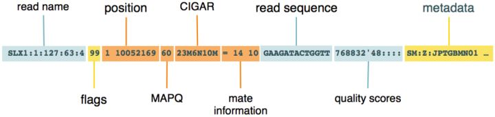
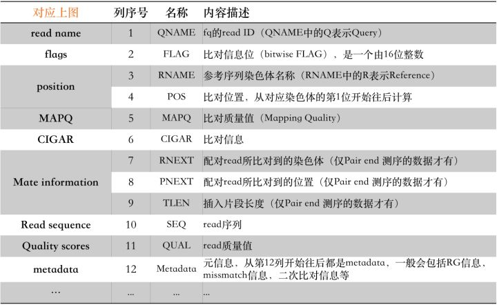
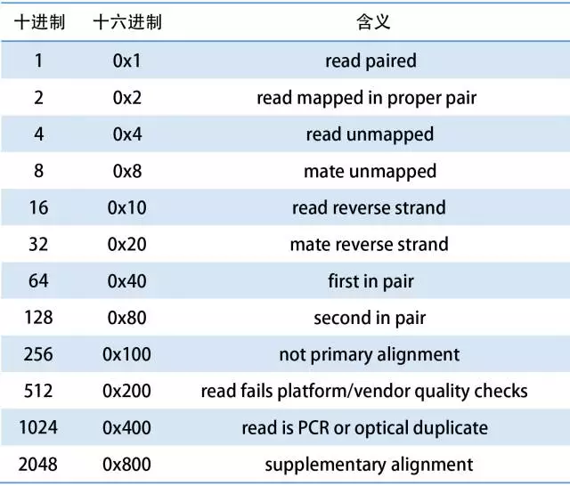
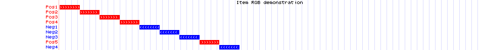
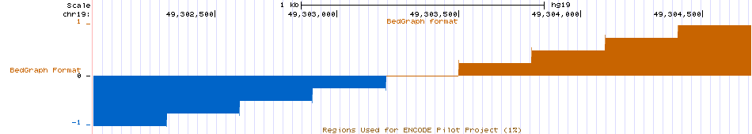
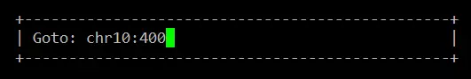

## 目录

* [FileFormat](#FileFormat)
  * [general](#general)
    * [fastq-fasta](#fastq-fasta)
    * [bam-sam](#bam-sam)
    * [bed-bedgraph](#bed-bedgraph)
    * [wig-bigwig](#wig-bigwig)
    * [bcf-vcf-maf](#bcf-vcf-maf)
    * [gf-gtf](#gf-gtf)
  * [manipulation](#manipulation)
    * [samtools](#samtools)
    * [bedtools](#bedtools)
    * [BCFtools*](#BCFtools*)

# FileFormat

## general

&emsp;&emsp;下面总结的一些格式文件，在[Genome browser FAQ](https://genome.ucsc.edu/FAQ/FAQformat.html#format1.7)都能够找到，下面的还有一些更详细或更适合参考信息及说明。

##### fastq-fasta

&emsp;&emsp;两种储存sequence的格式，参考[Fasta和Fastq详解](https://zhuanlan.zhihu.com/p/20714540)

##### bam-sam

&emsp;&emsp;BAM是目前基因数据分析中最通用的**比对数据存储格式**，它既适合于短read也适合于长read，最长可以支持128Mbp的超大read！除了后缀是.bam之外，可能还会看到.cram，甚至.sam后缀的文件，其实它们一个是BAM的高压缩格式(.cram)——IO效率比原来的BAM要略差；另一个是BAM的纯文本格式（.sam）。[理解并操作BAM文件](https://zhuanlan.zhihu.com/p/31405418),[如何使用Python处理BAM](https://zhuanlan.zhihu.com/p/31625187)，[Sam、Bam、Cram格式详解](https://zhuanlan.zhihu.com/p/31405418)

- header

  &emsp;Header每一行都用`@` 符号开头，里面主要包含了版本信息，序列比对的参考序列信息，如果是标准工具（bwa，bowtie，picard）生成的BAM，一般还会包含生成该份文件的参数信息，如`@PG`。

- record

  &emsp;record每个字段之间用 `tab`符号分开，至少包含以下字段：

  







##### bed-bedgraph

###### bed

&emsp;&emsp;BED 文件格式提供了一种灵活的方式来定义的数据行，以用来描述注释信息，BED行有3个必须的列和9个额外可选的列，一般peaks文件是bed格式。请参考[bed格式详解](https://zhuanlan.zhihu.com/p/27876814)，[bed格式的四种形式](https://zhuanlan.zhihu.com/p/49560007)

> If your data set is BED-like, but it is very large (over 50MB) and you would like to keep it on your own server, you should use the [bigBed](https://genome.ucsc.edu/goldenPath/help/bigBed.html) data format.

- 必选行

  1. chrom：染色体或scafflold 的名字(eg：chr3， chrY， chr2_random， scaffold0671 )
  2. chromStart：染色体或scaffold的起始位置，染色体第一个碱基的位置是0
  3. chromEnd：染色体或scaffold的结束位置，**染色体的末端位置没有包含到显示信息里面**。例如，首先得100个碱基的染色体定义为chromStart =0 . chromEnd=100, 碱基的数目是0-99

- 可选行

  4. name：指定BED行的名字，这个名字标签会展示在基因组浏览器中的bed行的左侧。

  5. score：0到1000的分值，如果在注释数据的设定中将原始基线设置为１，那么这个分值会决定现示灰度水平（数字越大，灰度越高）
  6. strand：定义链的方向，"+" 或者"-"
  7. thickStart：起始位置（The starting position at which the feature is drawn thickly）(例如，基因起始编码位置）
  8.  thickEnd：终止位置（The ending position at which the feature is drawn thickly）（例如：基因终止编码位置）
  9. itemRGB：是一个RGB值的形式， 如( 255, 0, 0)， 如果itemRgb设置为"on", 这个RBG值将决定数据的显示的颜色。
  10. blockCount：BED行中的block数目，也就是外显子数目
  11. blockSize：用逗号分割的外显子的大小, 这个item的数目对应于BlockCount的数目
  12. blockStarts：用逗号分割的列表, 所有外显子的起始位置，数目也与blockCount数目对应.

举例：

```
browser position chr7:127471196-127495720
browser hide all
track name="ItemRGBDemo" description="Item RGB demonstration" visibility=2 itemRgb="On"
chr7    127471196  127472363  Pos1  0  +  127471196  127472363  255,0,0
chr7    127472363  127473530  Pos2  0  +  127472363  127473530  255,0,0
chr7    127473530  127474697  Pos3  0  +  127473530  127474697  255,0,0
chr7    127474697  127475864  Pos4  0  +  127474697  127475864  255,0,0
chr7    127475864  127477031  Neg1  0  -  127475864  127477031  0,0,255
chr7    127477031  127478198  Neg2  0  -  127477031  127478198  0,0,255
chr7    127478198  127479365  Neg3  0  -  127478198  127479365  0,0,255
chr7    127479365  127480532  Pos5  0  +  127479365  127480532  255,0,0
chr7    127480532  127481699  Neg4  0  -  127480532  127481699  0,0,255
```

在UCSC GENOME BROWSER可视化：



###### bigbed

&emsp;二进制压缩版的BED或bedgraph，压缩方式是将前三列的位置信息用二进制的索引代替，这种文件只会将目前可视化需要的数据传送到UCSC GENOME BROWSER。

- bedtobigbed

  ```shell
  $ sort -k1,1 -k2,2n unsorted.bed > input.bed
  # then, 将track、browser行去除
  bedToBigBed input.bed chrom.sizes myBigBed.bb
  # last，添加track行信息，如track type=bigBed name="My Big Bed" description="A Graph of Data from My Lab" bigDataUrl=http://myorg.edu/mylab/myBigBed.bb
  ```

- 其他操作

  ```shell
  # 提取信息
  bigBedSummary
  bigBedInfo
  ```

  

###### bed detail

&emsp;在BED 文件的基础上，再对每一行的区域增加更细致的文字描述，不常用，见[官方描述](<https://genome.ucsc.edu/FAQ/FAQformat.html#format1>)

> 注意事项：**Requirements** for BED detail custom tracks are: fields must be tab-separated, "type=bedDetail" must be included in the [track line](https://genome.ucsc.edu/goldenPath/help/customTrack.html#TRACK)

###### bedgraph

&emsp;bedGraph对各个区域给出了一个连续性数据（continuous-valued data），**用于展示各个区域的表达量或对应的概率值**。

> 注意事项：If you have a very large data set and you would like to keep it on your own server, you should use the [bigWig](https://genome.ucsc.edu/goldenPath/help/bigWig.html) data format.

bedgraph格式如下：

```
track type=bedGraph name=track_label description=center_label
    visibility=display_mode color=r,g,b altColor=r,g,b
    priority=priority autoScale=on|off alwaysZero=on|off gridDefault=on|off
    maxHeightPixels=max:default:min graphType=bar|points viewLimits=lower:upper
    yLineMark=real-value yLineOnOff=on|off
    windowingFunction=maximum|mean|minimum smoothingWindow=off|2-16
    
chromA  chromStartA  chromEndA  dataValueA
chromB  chromStartB  chromEndB  dataValueB
```

举例：

```
browser position chr19:49302001-49304701
browser hide all
browser pack refGene encodeRegions
browser full altGraph
#	300 base wide bar graph, autoScale is on by default == graphing
#	limits will dynamically change to always show full range of data
#	in viewing window, priority = 20 positions this as the second graph
#	Note, zero-relative, half-open coordinate system in use for bedGraph format
track type=bedGraph name="BedGraph Format" description="BedGraph format" visibility=full color=200,100,0 altColor=0,100,200 priority=20
chr19 49302000 49302300 -1.0
chr19 49302300 49302600 -0.75
chr19 49302600 49302900 -0.50
chr19 49302900 49303200 -0.25
chr19 49303200 49303500 0.0
chr19 49303500 49303800 0.25
chr19 49303800 49304100 0.50
chr19 49304100 49304400 0.75
chr19 49304400 49304700 1.00
```





```shell
# bed to bedgraph
awk '{ print $1"\t"$2"\t"$3"\t"$5 }' summits.bed > summits.bedgraph
```

##### wig-bigwig

&emsp;&emsp;&emsp;Wiggle、BigWig和bedgraph（它们均由UCSC规定的文件格式，可以无缝连接到UCSC的Genome Browser工具里面进行可视化）仅仅用于追踪参考基因组的各个区域的覆盖度，测序深度；与sam/bam格式文件不同，bam或者bed格式的文件主要是为了追踪我们的reads到底比对到了参考基因组的哪些区域，更多可以请参考[官方文档](<https://genome.ucsc.edu/goldenPath/help/wiggle.html>)或[博客](<https://vip.biotrainee.com/d/169-wiggle-bigwig-bedgraph>)。

- wiggle

  简写为wig，**表示基因组上一个区域的信号**，可以上传至UCSC上进行可视化，一般使用MACS2峰值探测后可以产生wig格式的文件。

- bigwiggle

  &emsp;简写为bw，**它规定了全基因组数据的每个坐标区间的测序深度**，bigWig是通过wig格式的文件转换的二进制压缩文件，是一种全基因组计算或实验信号数据的压缩的、索引的二进制格式，使用该格式更加节省空间。

  > **The wiggle (WIG) format is an older format for display of dense, continuous data** such as GC percent, probability scores, and transcriptome data. **Wiggle data elements must be equally sized.** The **bedGraph format is also an older format used to display sparse data or data that contains elements of varying size.**

  &emsp;

  &emsp;Wig的数据是面向行的，第一行必须定义track的属性，`track type=wiggle_0`，指定track为Wig track，其余为可选参数。一般不用管这些参数，除非你已经很熟悉UCSC的Genome Browser工具。Wig中的value值可以是整数，实数，正数或者负数。只有指定的位置有value值，没有制定的位置则没有value，且不会在UCSU Genome Browser中作出图。其数据行定义方式有两种：

- vriableStep

  下面数据表示，在染色体chrom 2上300701-300702上的值都是12.5

  ```
  variableStep chrom=chr2
  300701 12.5
  300702 12.5
  300703 12.5
  300704 12.5
  300705 12.5 
  ```

  其等价于：

  ```
  variableStep chrom=chr2 span=5
  300701 12.5
  ```

- fixedStep

  表示在3号染色体400601-400605, 400701-400705, and 400801-400805三个区域，value值分别为11, 22, 和 33。

  ```
  fixedStep chrom=chr3 start=400601 step=100 span=5
  11
  22
  33 
  ```

> 注意事项：BigWig files created from bedGraph format use "0-start, half-open" coordinates, but bigWigs that represent variableStep and fixedStep data are generated from wiggle files that use "1-start, fully-closed" coordinates. 请具体参考[ucsc坐标系统](<http://genome.ucsc.edu/blog/the-ucsc-genome-browser-coordinate-counting-systems/>)

##### bcf-vcf-maf

&emsp;&emsp;VCF([Variant Call Forma](http://vcftools.sourceforge.net/specs.html))是一种文本文件格式，用于存储变异数据，最初设计用于SNP和短INDEL的存储，也是用于结构变异的存储。BCF( binary variant call format)，是VCF的二进制版本，它与VCF中保留的信息相同，而对于大量样本而言，BCF处理效率更高。BCF和VCF之间的关系类似于BAM和SAM之间的关系。

- VCF format

  1. 以`#`开头的注释部分

     注释部分有很多对VCF的介绍信息，包括版本、来源等。

  2. 数据行

     - CHROM	染色体
     - POS	染色体上的位置
     - ID	variantID，是指如果该SNP在dbSNP数据库里面，就会有一个相应的编号；反之用`.`标记
     - REF	参考基因组所对应的碱基，即"真实碱基"
     - ALT 	该sample所对应的碱基，即"变异碱基"
     - QUAL	Phred格式的质量值，越大表示该碱基变异越真实
     - FILTER	该值对原始变异位点做再进一步过滤，如果通过，则会标注`pass`，`.`表示没有进行过任何过滤
     - INFO 	该数据行variant信息，`key=value;key=value`形式出现
     - Sample	样本信息

- MAF format

  &emsp;MAF(Mutation Annotation Format)文件是一种制表符分隔的、具有来自VCF文件聚合变异信息的一种文本文件，所谓聚合变异信息，主要是指每一个maf文件是一个project level，相比于vcf还去除了可能得生殖变异影响。MAF列数众多，具体请参考[官方文档](<https://docs.gdc.cancer.gov/Data/File_Formats/MAF_Format/>)

##### gff-gtf

&emsp;&emsp;两种文件格式非常类似，均为9列[参考文档](https://asia.ensembl.org/info/website/upload/gff.html)：

| 1                       | 2                 | 3            | 4                | 5              | 6     | 7      | 8     | 9          |
| ----------------------- | ----------------- | ------------ | ---------------- | -------------- | ----- | ------ | ----- | ---------- |
| reference sequence name | annotation source | feature type | start coordinate | end coordinate | score | strand | frame | attributes |

&emsp;&emsp;GFF(general feature format)，是一种用来描述基因组特征的文件，现在使用的大部分都是GFF3。GFF允许使用`#`作为注释符号，例如：

```shell
##gff-version 3
##created 11/11/11
```

```shell
# 注意观察第九列
# ID属性是必需的
# Parent属性，它表明了当前的特征是Parent特征的子集。

Contig01  PFAM  gene  501  750  .  +  0  ID=geneA;Name=geneA
Contig01  PFAM  exon  501  650  .  +  2  ID=exonA1;Parent=geneA
Contig01  PFAM  exon  700  750  .  +  2  ID=exonA2;Parent=geneA
```

&emsp;&emsp;GTF(gene transfer format)，当前主流版本是GTF2，主要是用来对基因进行注释。GTF格式有两个硬性标准：

- 根据所使用的软件的不同，`feature types`是必须注明的。

- 第9列必须以`gene_id`以及`transcript_id`开头

  ```shell
  # 第9列示例,注意对比GFF
  gene_id "geneA";transcript_id "geneA.1";database_id "0012";modified_by "Damian";duplicates 0;
  ```

&emsp;&emsp;差异比较：

| 列                      | GTF2                                    | GFF3            |
| ----------------------- | --------------------------------------- | --------------- |
| reference sequence name | same                                    | same            |
| annotation source       | same                                    | same            |
| feature type            | feature requirements depend on software | can be anything |
| start coordinate        | same                                    | same            |
| 5. end coordinate       | same                                    | same            |
| score                   | not used                                | optional        |
| strand                  | same                                    | same            |
| frame                   | same                                    | same            |
| attributes              | space-separator                         | `=`             |

## manipulation

##### samtools

&emsp;&emsp;顾名思义就是用于处理sam与bam格式的工具软件，能够实现二进制查看、格式转换、排序及合并等功能，结合sam格式中的flag、tag等信息，还可以完成比对结果的统计汇总。同时利用linux中的grep、awk等操作命令，还可以大大扩展samtools的使用范围与功能。从samtools还分离出一个**专门用于处理高通量数据的API——htslib**。[samtools Mannual](http://www.htslib.org/doc/samtools.html)。特别的，当文件还比较小的情况，关于查看bam数据，我们可以使用[IGV工具](http://software.broadinstitute.org/software/igv/)。

- `samtools view`

  &emsp;---查看sam文件（sam 格式转bam）

  ```shell
  -b：bam格式输出
  -1：use fast BAM compression (implies -b)
  -u：以未压缩的bam格式输出，一般与linux命令配合使用
  -C：output CRAM (requires -T)
  -h：在sam输出中包含header信息
  -H：只输出header信息
  -c：print only the count of matching records
  -S       ignored (input format is auto-detected)
  -T, --reference FILE
                 Reference sequence FASTA FILE [null]
  
  -f [INT]：只输出在比对flag中包含该整数的序列信息
  -F [INT]：跳过比对flag中含有该整数的序列
  -o [file]：标准输出结果文件
  
  -@, --threads INT 线程数
  
  # 常用示例：
  $ samtools view -bS test.sam > test.bam
  $ samtools view  -h test.bam > test.sam
  ```

- `samtools sort`

  &emsp;根据左起位点对序列排序，并输出为bam文件

  ```shell
  $ samtools sort [options] <input_file> <output_file>
  
  -l INT     Set compression level, from 0 (uncompressed) to 9 (best)
  -m INT     Set maximum memory per thread; suffix K/M/G recognized [768M]
  -n         Sort by read name
  -o FILE    Write final output to FILE rather than standard output
  -T PREFIX  Write temporary files to PREFIX.nnnn.bam
  -@, --threads INT
  ```

- `samtools merge`

  &emsp;将多个排序后的序列文件合并为一个文件

  ```shell
  $ samtools merge [-nurlf] [-h inh.sam] [-b <bamlist.fofn>] <out.bam> <in1.bam> [<in2.bam> ... <inN.bam>]
  
  -n：指定输入文件是以reads名称排序的（与sort中的-n参数配合使用）
  -b FILE:FILE中每行是一个需要merge的bam文件
  ```

- `samtools cat`

  &emsp;将多个bam文件合并为一个bam文件（与merge命令的区别是cat不需要将bam文件提前进行排序）

  ```shell
  $ samtools cat [-h header.sam] [-o out.bam] <in1.bam> [...]
  ```

- `samtools flagstat`

  &emsp;---统计bam文件中的比对flag信息，并输出比对统计结果

  ```shell
  $ samtools flagstat eg2.bam
  
  # 统计结果
  # total：分析的总reads数（bam文件所有行数）
  # mapped：比对上的reads数（总体比对率）
  # paired in sequencing：成对的reads总数
  # read1：属于reads1的reads数量
  # read2：属于reads2的reads数量
  # properly paired：正确配对的reads数量
  # with itself and mate mapped：一对reads均比对上的reads数
  # singletons：只有单条reads比对上的reads数
  ```

- `samtools index`

  &emsp;对排序后的序列建立索引，并输出为bai文件，用于快速随机处理

  ```shell
  $ samtools index <sorted_bam_file>
  
  # e.g:
  $ samtools index abc.sort.bam abc.sort.bam.bai
  ```

- `samtools tview`

  &emsp;以文本定位查看器的方式来展示各条reads的比对情况

  ```shell
  $ samtools tview [options] <sorted_bam_file> [参考基因组fasta文件]
  
  #   -d display      output as (H)tml or (C)urses or (T)ext 
  #   -p chr:pos      go directly to this position
  #   -s STR          display only reads from this sample or group
  ```

  &emsp;第一行为参考序列的碱基坐标，第二行为参考序列，第三行开始即为按排序顺序依次比对上参考序列的各条reads，其中仍以碱基字符表示的则是与参考序列有差异的部分;可在该界面中按g键，并在出现的方框内输入想要查看的参考序列名及对应位置信息就可以快速跳转到该位置上:

  

- `samtools depth`

  &emsp;计算每个位点的深度值（所有reads中包含该点的总数),输出结果从左到右依次为参考基因组、在基因组上的位置、深度值。

  ```shell
  $ samtools depth [options] <排序后的bam文件1> <排序后的bam文件2>
  
  -q [int]：基础reads质量阈值
  -Q [int]：mapping质量阈值
  -r [chr:from-to]：选择需要统计深度的区域
  ```

##### bedtools

&emsp;&emsp;BEDTools是可用于genomic features的比较，相关操作及进行注释的工具。而genomic features通常使用Browser Extensible Data (BED) 或者 General Feature Format (GFF)文件表示，用UCSC Genome Browser进行可视化比较。[bedtools使用文档](https://bedtools.readthedocs.io/en/latest/index.html)

#####  BCFtools*