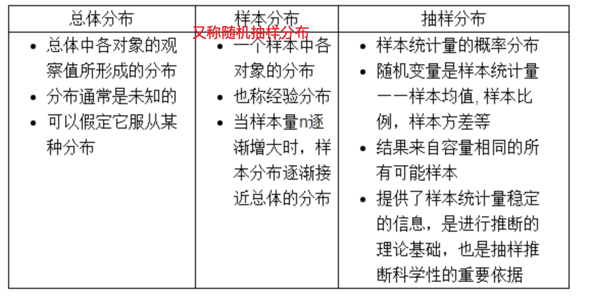
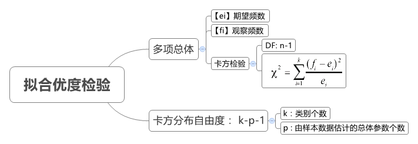
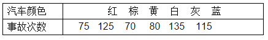
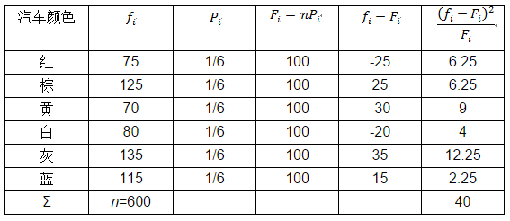
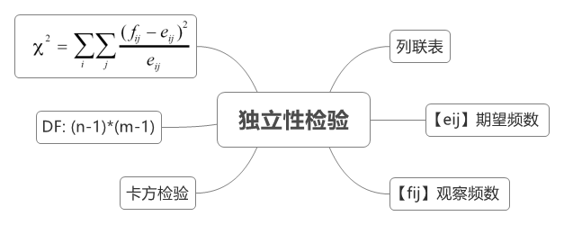

# 写在篇前

### 数据分类

&emsp;“数是一切事物的本源”—毕达哥拉斯，学习统计最重要的一部分就是对各类"数"进行统计，一般数据分为以下四类：

- 定类数据：也称名义值数据，属于定性数据、离散数据
- 定序数据：属于定性数据、离散数据
- 计数数据：属于定量数据，一般称为离散数据，但我们一般又希望能用连续数据的方法来分析它
- 计量数据：属于定量数据、连续数据

### 数据测量误差

- 系统误差

  系统误差是测量系统的固有误差，又分为仪器误差和理论误差，需要注意的是<u>多次测量求平均值并不能消除系统误差。</u>关于测量系统，请参考[什么是好的测量系统](<https://zhuanlan.zhihu.com/p/24248115>)

  - 仪器误差

    仪器误差是指仪器本身的缺陷或者没有按操作规程使用仪器带来的误差，如长时间未校准造成的漂移，测量环境不达标，仪器未校准等，通常这些误差不易察觉

  - 理论误差

    理论误差这是由于测量所依据的理论公式本身的近似性，或实验条件不能达到理论公式所规定的要求，或者是实验方法本身不完善所带来的误差。如用电压表测电压，理论上电压表的内阻应该是无穷大，但这是不可能的，因此在测电压时相当于并联了一个电阻，从而造成测出的电压值存在偏差

- 随机误差

  随机误差是由于测量过程中的随机变异所导致的，测量结果有时大，有时小，多次测量会呈现出统计规律。

  

> 近似测量值=真值+系统误差+随机误差

### 统计学方法分类

&emsp;统计学方法可以分为描述性统计和推断统计两大部分：

- 描述性统计
  - 图表法
  - 数值法
- 推断性统计
  - 概率论
  - 抽样理论
  - 估计理论
  - 假设检验

# 抽样分布

&emsp;&emsp;下面主要总结**抽样分布**：大多数情况下，总体是无限的，我们不可能收集到总体的所有元素来进行测量；即使是有限总体，很多情况下收集全部元素也是不必要的。另外每次抽样的结果可能都会有所不同，因此样本的均值、标准差和比例也有分布，这就是**抽样分布**。我们就是用抽样分布来判断样本的统计量在多大程度上逼近总体的参数。

&emsp;<u>思考：统计分布、随机变量分布、总体分布、样本分布、抽样分布之间的关系</u>

&emsp;&emsp;其中需要清楚的是，随机变量分布多种多样，已知的就有十几种；但抽样分布只有四种，分别是正态分布、*t*-分布、$χ²  $ -分布、*F*-分布，其中后三种分布适用于小样本抽样，正态分布适用于大样本抽样。

### $χ²  $ 分布

> 约定：均值、标准差、比例分别使用*μ*、*σ*、π表示；样本均值、标准差、比例分别使用、*S*、*p*表示；

&emsp;&emsp;$χ²  ​$ -分布由被称为<u>数理统计学之父</u>的卡尔·皮尔逊(Karl Pearson)于1900年提出的，该方法常用于计数数据的假设检验，属于非参数检验的范畴，其根本思想就是在于比较理论频数和实际频数的吻合程度或拟合优度问题。

##### 基本理论

- 若`Y1,…,Yk`是独立的标准正态变量，则它们的平方和:

$$
X = \sum_{i=1}^{k}Y_i^2
$$

&emsp;服从自由度(degrees of freedom)为`k`的卡方分布，记作$X \sim \chi^2_k​$

- $χ² ​$ 分布统计量计算公式：
  $$
  χ² = \sum_{}^{}(f_i-F_i)^2/F_i
  $$
  

##### 实际应用

&emsp;在实际应用中主要用于以下两个方面：

1. **拟合优度检验**：

   

   假设有`n`个样本被分入`K`个类别`C1,C2…,CK`，想要检验这`K`个类别的概率是否为`p1,…,pK`

   举例：某个城市在某一时期内共发生交通事故600次，按不同颜色小汽车分类如下图所示，问：交通事故是否与汽车的颜色有关？

   

   解：假设交通事故与汽车的颜色无关，则每种颜色的小汽车发生交通事故的可能性是一样的，均为`1/6`，计算统计量：

   

   上表计算出$χ²  ​$ =40，取*α*=0.05，因没有估计参数，则自由度为6-0-1=5，查表得，因此我们可以认定交通事故与小汽车的颜色有关。

   &emsp;

2. **独立性检验**

   

   假设有两种事件`A`和`B`，其中`A`的可能结果为`A1,…,AK1`，B的可能结果为`B1,…,BK2`，现在观测了`n`个样本属于`A`中的哪一类和`B`中的哪一类，现要检验一个样本属于`A`中的哪一类和属于`B`中的哪一类是否独立。

   举例：想知道喝牛奶对感冒发病率有没有影响，数据如下：

   |                | **感冒人数** | **未感冒人数** | **合计** | **感冒率** |
   | -------------- | ------------ | -------------- | -------- | ---------- |
   | **喝牛奶组**   | **43**       | **96**         | **139**  | **30.94%** |
   | **不喝牛奶组** | **28**       | **84**         | **112**  | **25.00%** |
   | **合计**       | **71**       | **180**        | **251**  | **28.29%** |

   解：

   1. 建立假设检验H0：喝牛奶和感冒相互独立

   2. 计算理论值

      &emsp;我们假设了喝牛奶对感冒发病率是没有影响的，所以我们可以得出感冒的发病率实际是（43+28）/（43+28+96+84）= 28.29%

      因此，可以计算得理论值应该是：

      |                | **感冒人数**                | **未感冒人数**                  | **合计** |
      | -------------- | --------------------------- | ------------------------------- | -------- |
      | **喝牛奶组**   | **139\*0.2829**=**39.3231** | **139\*(1-0.2829)**=**99.6769** | **139**  |
      | **不喝牛奶组** | **112\*0.2829**=**31.6848** | ****112\*(1-0.2829)**=80.3152** | **112**  |
      | **合计**       | **71**                      | **180**                         | **251**  |

   3. 计算卡方值
      $$
      χ² = (43 - 39.3231)^2 / 39.3231 + (28 - 31.6848)^2/ 31.6848
      + (96 - 99.6769)^2/ 99.6769 + (84 - 80.3152)^2/ 80.3152 = 1.077
      $$

   4. 查卡方临界值表，求P值

      自由度=(row_num-1)(col_num-1)=1，所以`V = 1，a=0.05`，查表卡方分布的临界概率是：3.84，此时，$χ²  $ = 1.077 < 3.84，p>0.05，因此差异无显著统计学意义，即原假设成立，喝牛奶和感冒无关。

### F-分布

### t-分布

通常使用单样本*t-*检验来判断偏倚(准度)

# 评价尺度

### 方差分析ANOVA

### 皮尔森相关系数

### Pvalue-qvalue

### FoldChange

### t-test

### Chi-SquaredTest

### ROC-PR-AUC

### ARI-NMI-Q

# 参考来源

1. [张老师漫谈六西格玛](<https://zhuanlan.zhihu.com/teacher-zhang>)
2. [测量值的分类](<https://zhuanlan.zhihu.com/p/24200454>)
3. [什么是好的测量系统](<https://zhuanlan.zhihu.com/p/24248115>)
4. [卡方检验实例](<https://zhuanlan.zhihu.com/p/38302135>)
5. [卡方检验实例2](<https://blog.csdn.net/snowdroptulip/article/details/78770088>)